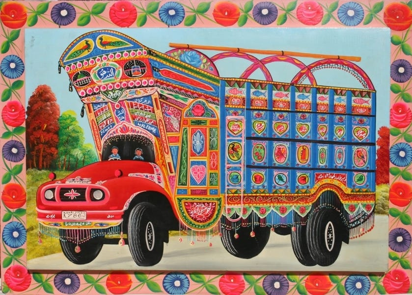

# 🚌 Truck Baaz — Pakistani Cultural Runner

A 3D endless runner game built in Unity that celebrates Pakistani truck art culture.

---

## 🎮 About The Game

Truck Baaz is a Pakistani cultural endless runner where you run on a busy Pakistani road, dodging decorated buses and collecting cultural items. The game celebrates Pakistan's famous truck art tradition — one of the most recognized art forms in the world.

**Theme:** Culture and Heritage — Pakistani Truck Art

**Message:** Pakistani culture is vibrant, creative, and worth celebrating.

---

## 🕹️ How To Play

| Control | Action |
|---|---|
| A / Left Arrow | Move to left lane |
| D / Right Arrow | Move to right lane |
| Spacebar | Jump over barriers |

### Objective
- Survive as long as possible
- Collect cultural items for bonus points
- Beat your personal high score

---

## ⚠️ Obstacles

| Obstacle | Effect |
|---|---|
| 🚌 Pakistani Decorated Bus | Instant Death |
| 🚧 Road Barrier | -1 Life |

---

## 🏆 Collectibles

| Item | Points |
|---|---|
| ☕ Chai Cup | +10 points |
| 🍉 Watermelon | +15 points |
| 🍦 Ice Cream | +25 points |

---

## 🎯 Game Systems

### Lives System
- Player starts with 3 lives
- Hitting a barrier reduces lives by 1
- Brief invincibility activates after each hit
- Direct bus collision = instant game over

### Score System
- Score increases every second you survive
- Collecting cultural items adds bonus points
- High score saved locally and displayed on all screens

### Difficulty Curve
- Buses speed up as time passes and score increases
- Spawn rate increases gradually
- After score 20 — two buses occasionally spawn simultaneously
- Always at least one free lane available — never unfair

---

## 🎨 Design Principles Applied

This game was designed following game design theory:

**MDA Framework:**
- **Mechanics** — Lane switching, jumping, obstacle spawning, collectible system
- **Dynamics** — Risk vs reward decisions, speed adaptation, high score chasing
- **Aesthetics** — Excitement, tension, cultural appreciation, pride in high score

**Week 8 Principles:**
- ✅ Clarity — Player always knows what happened and why
- ✅ Consistency — Same input always produces same output
- ✅ Feedback — Audio and visual response for every action
- ✅ Fairness — Skill based, obstacles always visible
- ✅ Meaningful Choices — Collectibles near obstacles create real decisions
- ✅ Learnability — Easy to start, difficult to master

**Week 10 Systems:**
- ✅ Risk vs Reward — Safe play vs risky collectible collection
- ✅ Forgiving Design — 3 lives and invincibility frames
- ✅ Difficulty Curve — Gradual speed and spawn rate increase
- ✅ Game Economy — Score as reward, lives as resource
- ✅ Retention — High score system brings players back

---

## 📋 Requirements

- Windows PC
- No installation required
- Just run **Truck Baaz.exe**

---

## 🛠️ Built With

- **Engine** — Unity 6.3 LTS
- **Language** — C#
- **Render Pipeline** — Universal Render Pipeline (URP)

---

## 📦 Assets Used

| Asset | Source |
|---|---|
| Bus Model | Low Poly Bus Kozak I-VAN — Cobra Games Studio (Unity Asset Store) |
| Character | Simple Skeleton — Prizma (Unity Asset Store) |
| Road Assets | Kajaman's Roads Free (Unity Asset Store) |
| Food Items | Low Poly Food Pack Free (Unity Asset Store) |
| Sounds | Envato Elements (Licensed) |

---

## 📁 Project Structure
Truck Baaz/
├── Assets/
│   ├── Scripts/
│   │   ├── PlayerMovement.cs
│   │   ├── PlayerHealth.cs
│   │   ├── ObstacleSpawner.cs
│   │   ├── ObstacleMover.cs
│   │   ├── CollectibleSpawner.cs
│   │   ├── Collectible.cs
│   │   ├── ScoreManager.cs
│   │   ├── UIManager.cs
│   │   ├── AudioManager.cs
│   │   ├── GameOverManager.cs
│   │   ├── MainMenuManager.cs
│   │   ├── CameraShake.cs
│   │   └── TreeSpawner.cs
│   ├── Prefabs/
│   │   ├── Bus
│   │   ├── Barrier
│   │   ├── ChaiCup
│   │   ├── Star
│   │   ├── Flower
│   │   └── Tree
│   ├── Scenes/
│   │   ├── MainMenu
│   │   ├── GameScene
│   │   └── GameOver
│   └── Sounds/
├── ProjectSettings/
└── README.md

---

## 🎓 Academic Information

**Project:** Game Design — Semester Project
**Institution:** UET Peshawar
**Student:** Sohaib
**Year:** 2026

---

## 🚀 How To Run

1. Download the repository
2. Open **TruckBaaz Build** folder
3. Double click **Truck Baaz.exe**
4. Click **Play** on main menu
5. Enjoy the game!

---

## 📝 License

This project was created for academic purposes at UET Peshawar.
Free assets used from Unity Asset Store under their respective licenses.
Sound assets licensed from Envato Elements.

---

*Made with ❤️ for Pakistani Culture*